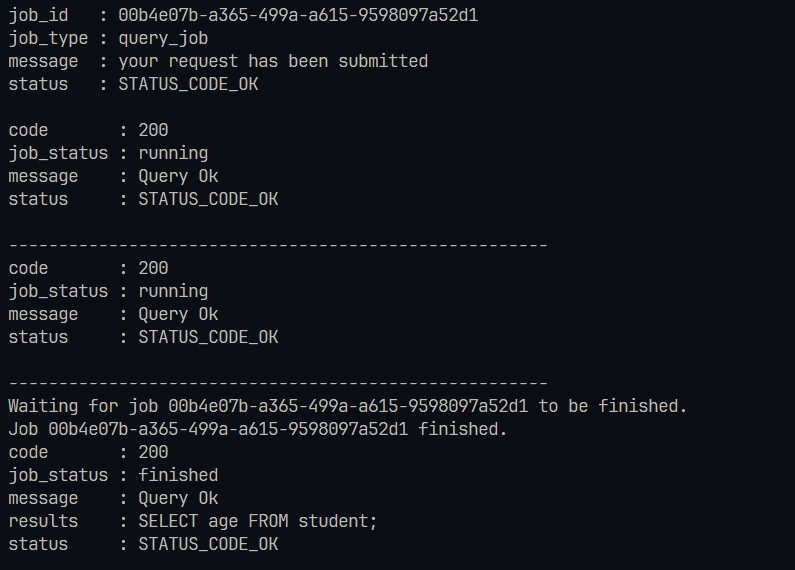
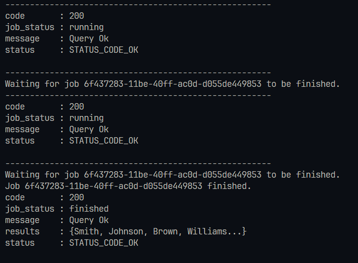

## About This Project

This is part os an internship-challenge that exposes GenAI services to a website and serves as bridge

**Built with**


This is a **backend server program** with the following functionality:


- **Custom SlaveWorker Queue** running in a child thread
- **Custom NLIDB Implementation**
- **Endpoint Handlers** for query processing
- **Token Generator** (Yet to be implemented)

### **How It Works?**
A natural query is posted to the endpoint `POST /query`, and the server responds with a `job_id`.

Users must **poll** the server at `GET /get-status/<uuid:job_id>` at regular intervals to check the job status.

Users should check the `job_status` field in the response to verify whether the job has been executed successfully.

Once the job is completed, users can fetch the results from `GET /get-results/<uuid:job_id>`.

**Note:** Job deletion should be handled based on resource availability and project requirements.

## **Clone the Repository**
```bash
# Clone the repository
> git clone https://github.com/itsarunstark/gbgenai.git project-ai
> cd project-ai
```

## **Environment Setup**

### **For Windows**
```bash
# Create virtual environment
> python -m venv projectdir

# Activate virtual environment
> .\projectdir\Scripts\activate

# Install dependencies
> python -m pip install -r requirements.txt
```

### **For Linux**
```bash
# Create virtual environment
> python -m venv projectdir

# Activate virtual environment
> source ./projectdir/bin/activate

# Install dependencies
> python -m pip install -r requirements.txt
```

## **Generating a Mock Database**
```bash
# This will execute data.sql and generate testdb.db
> sqlite3 testdb.db
sqlite3> .read data.sql
sqlite3> .exit
```

## **Running The Server**
```bash
> cd project-ai
> python3 -m GBGenAI
```

## **Testing the Program**
```powershell
# Run the test suite (explain)
PS > .\tests\test-explain.ps1
# Run the test suite (query)
PS > .\tests\test-query.ps1
# Run the test suite (validate)
PS > .\tests\test-validate.ps1
```

This will execute automated tests to ensure the program runs as expected.

## **Request Format**

```json
    // for query response
    {
        "query": "department of students?"
    }

    // status response 
    {
        "code"     : 200,
        "job_id"   : "d0e61f12-602b-4644-a20c-432e5509b9b4",
        "job_type" : "query_job",
        "message"  : "your request has been submitted",
        "status"   : "STATUS_CODE_OK"
    }

    // to get job status

    {
        "job_id" : "d0e61f12-602b-4644-a20c-432e5509b9b4"
    }

    // job status response

    {
        "code"       : 200,
        "job_status" : "running",
        "message"    : "Query Ok",
        "status"     : "STATUS_CODE_OK"
    }

    // or for finished job

    {
        "code"       : 200,
        "job_status" : "finished",
        "message"    : "Query Ok",
        "status"     : "STATUS_CODE_OK"
    }

    // for getting results 
    // endpoint /get-results/d0e61f12-602b-4644-a20c-432e5509b9b4

    {
        "code"       : 200,
        "job_status" : "finished",
        "message"    : "Query Ok",
        "results"    : "SELECT age FROM student;",
        "status"     : "STATUS_CODE_OK"

    }
```


## **Sample Outputs**
Explain query for ```"departments of students?"```


Validate query for ```"age of students?"```



query for fetching ```lastname of students```




### Future Scopes and TODOs

- Add wsgi configuration file for more flexible control over server
- Replace custom Queue system with more industry-ready frameworks like redis
- Add Machine APIs to work with the server
- Change SQLite to a real database management system


